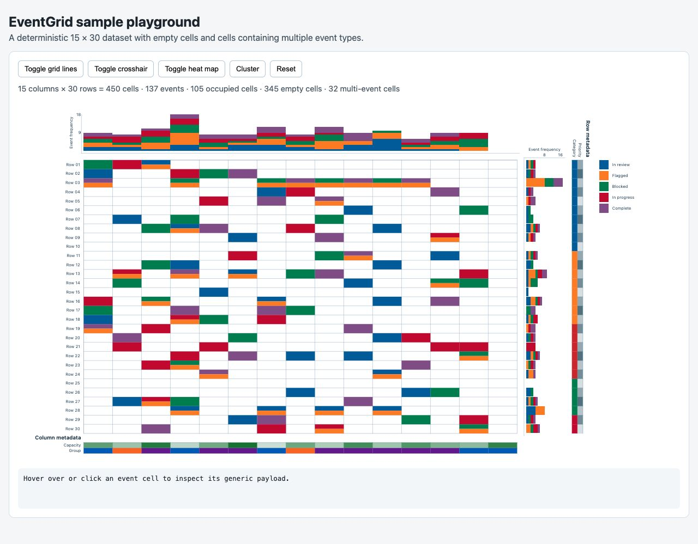

# EventGrid

EventGrid is a standalone matrix visualization for columns, rows, and typed events. It supports multiple events per cell, colored frequency histograms, an event legend, metadata tracks, heat maps, grid lines, crosshairs, and frequency-based ordering.



This project is a modern, domain-independent fork of the original [OncoJS OncoGrid](https://github.com/oncojs/oncogrid). The former donor, gene, mutation, and consequence model has been replaced by generic columns, rows, events, and event types.

## Quick start

Configure the GitHub Packages registry in the consuming project's `.npmrc`:

```ini
@dkfz-unite:registry=https://npm.pkg.github.com
//npm.pkg.github.com/:_authToken=${GITHUB_TOKEN}
```

For local installation, set `GITHUB_TOKEN` to a classic personal access token with `read:packages`. Do not commit the token. See [GitHub's npm registry documentation](https://docs.github.com/en/packages/working-with-a-github-packages-registry/working-with-the-npm-registry).

```sh
npm install @dkfz-unite/event-grid
```

```html
<div id="grid"></div>
```

```js
import EventGrid from '@dkfz-unite/event-grid';
import '@dkfz-unite/event-grid/style.css';

const configuration = {
  element: '#grid',
  columns: [{ id: 'c1', label: 'Alpha' }],
  rows: [{ id: 'r1', label: 'Planning' }],
  events: [
    { id: 'e1', columnId: 'c1', rowId: 'r1', type: 'active' }
  ]
};

const grid = new EventGrid(configuration);
grid.render();
```

No global scripts are required. The package includes its JavaScript builds, default CSS, and TypeScript declarations.

## Documentation

| Page | Contents |
| --- | --- |
| [Configuration](docs/configuration.md) | Complete constructor configuration and behavior options |
| [Data](docs/data.md) | Columns, rows, events, tracks, colors, and TypeScript types |
| [Layout](docs/layout.md) | Dimensions, spacing, scaling, and CSS prefix |
| [Methods](docs/methods.md) | Operations called on an EventGrid instance |
| [Emitted events](docs/emitted-events.md) | Native event subscriptions and payloads |
| [Styling](docs/styling.md) | Default stylesheet and supported overrides |
| [Development](docs/development.md) | Local setup, playground, checks, and release automation |
